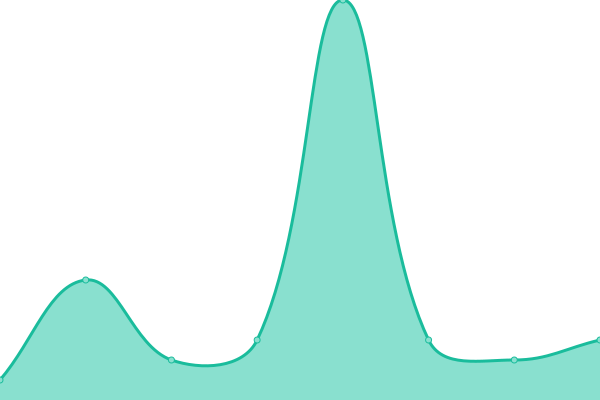

# [📈 Live Status](https://up.adf.cc.ua): <!--live status--> **🟧 Partial outage**

This repository contains the open-source uptime monitor and status page for [pbduc1802](https://up.adf.cc.ua), powered by [Upptime](https://github.com/upptime/upptime).

With [Upptime](https://upptime.js.org), you can get your own unlimited and free uptime monitor and status page, powered entirely by a GitHub repository. We use [Issues](https://github.com/smbcat16/uptime/issues) as incident reports, [Actions](https://github.com/smbcat16/uptime/actions) as uptime monitors, and [Pages](https://up.adf.cc.ua) for the status page.

<!--start: status pages-->
<!-- This summary is generated by Upptime (https://github.com/upptime/upptime) -->
<!-- Do not edit this manually, your changes will be overwritten -->
<!-- prettier-ignore -->
| URL | Status | History | Response Time | Uptime |
| --- | ------ | ------- | ------------- | ------ |
|  [moodle](https://adf-elearning.org) | 🟩 Up | [moodle.yml](https://github.com/smbcat16/uptime/commits/HEAD/history/moodle.yml) | 

 451ms
     
 | 

<a href="https://up.adf.cc.ua/history/moodle">98.64%</a>
    

|  [overleaf](https://overleaf.adf-elearning.org) | 🟥 Down | [overleaf.yml](https://github.com/smbcat16/uptime/commits/HEAD/history/overleaf.yml) | 

 572ms
     
 | 

<a href="https://up.adf.cc.ua/history/overleaf">0.00%</a>
    

|  [code](https://code.adf-elearning.org) | 🟥 Down | [code.yml](https://github.com/smbcat16/uptime/commits/HEAD/history/code.yml) | 

 560ms
     
 | 

<a href="https://up.adf.cc.ua/history/code">0.00%</a>
    

|  [pdf](https://pdf.adf-elearning.org) | 🟥 Down | [pdf.yml](https://github.com/smbcat16/uptime/commits/HEAD/history/pdf.yml) | 

 503ms
     
 | 

<a href="https://up.adf.cc.ua/history/pdf">0.00%</a>
    

|  [gemini](https://gemini.adf.cc.ua) | 🟩 Up | [gemini.yml](https://github.com/smbcat16/uptime/commits/HEAD/history/gemini.yml) | 

 1029ms
     
 | 

<a href="https://up.adf.cc.ua/history/gemini">98.44%</a>
    

|  [Google DNS 8.8.8.8](8.8.8.8) | 🟩 Up | [google-dns-8-8-8-8.yml](https://github.com/smbcat16/uptime/commits/HEAD/history/google-dns-8-8-8-8.yml) | 

 7ms
     
 | 

<a href="https://up.adf.cc.ua/history/google-dns-8-8-8-8">100.00%</a>
    

<!--end: status pages-->

[**Visit our status website →**](https://up.adf.cc.ua)

## 📄 License

- Powered by: [Upptime](https://github.com/upptime/upptime)
- Code: [MIT](./LICENSE) © [Anand Chowdhary](https://anandchowdhary.com), supported by [Pabio](https://pabio.com)
- Data in the `./history` directory: [Open Database License](https://opendatacommons.org/licenses/odbl/1-0/)
